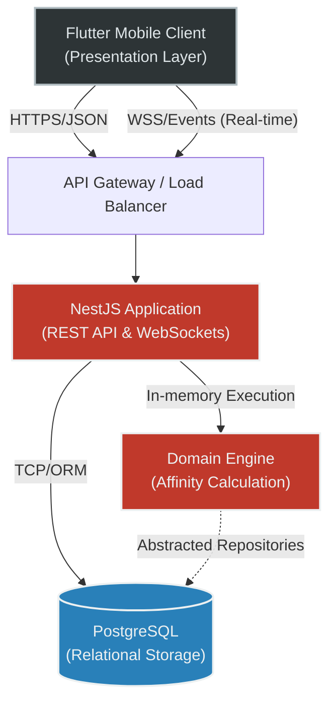

# Architecture & Implementation Reference

This document outlines the architectural blueprints, structural design, and core computational patterns underpinning the platform. The system enforces a strict separation of concerns through Clean Architecture, enabling horizontal scalability, robust real-time synchronization, and decoupled domain logic.

## 1. System Architecture

The following directed graph illustrates the synchronous and asynchronous communication streams across the primary infrastructure components. 



## 2. Project Structure (Clean Architecture)

The backend strictly adheres to Clean Architecture layers. The `domain` layer remains entirely framework-agnostic, deferring all I/O operations, transport protocols, and data persistence to the `infrastructure` and `presentation` layers.

```text
src/
├── application/                  # Application Services & Payload Transfer Objects
│   ├── dtos/
│   │   ├── calculate-affinity.dto.ts
│   │   └── vote.dto.ts
│   └── services/
│       ├── affinity.service.ts   # Orchestration & mapping
│       └── application.service.ts
├── domain/                       # Core Business Logic (Zero external dependencies)
│   ├── entities/
│   │   ├── quiz_vector.ts
│   │   └── flat.ts
│   ├── repositories/
│   │   └── flat.repository.interface.ts
│   └── use-cases/
│       └── calculate-affinity.use-case.ts
├── infrastructure/               # External adapters (TypeORM, DB drivers)
│   └── database/
└── presentation/                 # HTTP/WebSocket transport and routing
    ├── controllers/
    │   ├── affinity.controller.ts
    │   └── user.controller.ts
    └── guards/
```

## 3. Core Interfaces & DTOs

The following snippets demonstrate strict typing and validation perimeters. Internal implementation algorithms are abstracted to preserve security and proprietary logic.

**Distance Calculation Signature (Domain Layer):**
```typescript
// src/domain/use-cases/calculate-affinity.use-case.ts
import { Injectable } from '@nestjs/common';
import { QuizVector } from '../entities/quiz_vector';

@Injectable()
export class CalculateAffinityUseCase {
  /**
   * Computes mathematical compatibility distance between candidate and flat requirements.
   * Execution is bounded purely to memory; completely independent of the data access layer.
   */
  public execute(candidateVector: QuizVector, flatRequirements: QuizVector): number;
  
  private parseValue(val: any): number;
}
```

**Profile Management DTO (Presentation / Application Layer):**
```typescript
// src/presentation/controllers/user.controller.ts
import { IsOptional, IsString, IsArray, IsObject } from 'class-validator';

export class UpdateUserDto {
  @IsOptional()
  @IsString()
  readonly fullName?: string;

  @IsOptional()
  @IsString()
  readonly bio?: string;

  @IsOptional()
  @IsArray()
  @IsString({ each: true })
  readonly galleryPhotos?: string[];

  @IsOptional()
  @IsObject()
  readonly quizVector?: Record<string, any>;
}
```

## 4. Technical Challenges Solved

*   **High-Dimensional Matchmaking Optimization:** Resolving computational bottlenecking during candidate compatibility scoring. The distance calculation logic (`QuizVector` parsing and Euclidean/absolute difference summation) is isolated into pure memory operations within the domain layer. This prevents N+1 query latency against PostgreSQL and minimizes garbage collection overhead when running calculations iteratively over large candidate datasets.
*   **Architectural Boundary Enforcement:** Mitigating domain logic pollution via explicit inversion of control (IoC). The `src/domain` layer enforces a strict zero-dependency policy regarding NestJS HTTP decorators or TypeORM annotations. Data mutation relies strictly on abstracted interfaces (`flat.repository.interface.ts`), safeguarding core business rules against underlying framework modifications or database migrations.
*   **State Synchronization over Concurrent WebSockets:** Handling distributed state inconsistencies between the Flutter client and the NestJS cluster. Bi-directional WebSocket communication ensures real-time event broadcasting while avoiding race conditions. This maintains idempotent state updates across clients and eliminates resource-intensive HTTP polling mechanisms from the mobile presentation tier.
