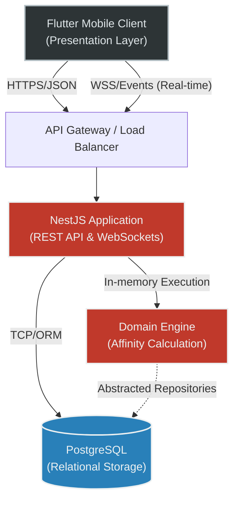

<div align="center">
  <h1>ComPiso: Algorithmic Co-Living Matchmaker</h1>
  <p><i>A highly scalable, decoupled platform designed to optimize the process of finding compatible flatmates.</i></p>
</div>

Moving away from traditional classification boards, the system leverages deterministic psychometric vector analysis to compute mathematical compatibility before a human interaction even begins.

---

## 1. The "Why": Problem Statement & Vision

Traditional real estate and flat-sharing applications rely on unstructured text descriptions and shallow filtering (e.g., price, location). This creates massive friction, high rejection rates, and ultimately, incompatible living situations. 

**The goal of ComPiso is to solve human compatibility through deterministic computation.**

By quantifying behavioral traits (cleanliness, noise tolerance, socialization) into n-dimensional vectors, the system eliminates cognitive bias and information asymmetry. The platform does not simply display available rooms; it computes the mathematical probability of a harmonious coexistence. 

---

## 2. The "What": Core Flows & Feature Set

The platform orchestrates a multi-actor workflow spanning candidates, flat owners (Captains), and existing tenants.

### 2.1. Vectorized Onboarding
Users do not write free-text biographies to find a match. They complete a psychometric calibration process.
*   **Mechanism:** 15 distinct lifestyle dimensions are quantified into a normalized `QuizVector` (values `0.0` to `1.0`) alongside boolean hard-constraints (smoking, pets).
*   **UI Implementation:** Interactive sliders and binary toggles that map directly to the application layer's DTO payload.

<br>

<table align="center">
  <tr>
    <td align="center"><br><b>Login / Onboarding</b></td>
    <td align="center"><br><b>Psychometric Calibration</b></td>
    <td align="center"><br><b>Geospatial Search</b></td>
    <td align="center"><br><b>Flat Roster</b></td>
  </tr>
</table>

<br>

### 2.2. Deterministic Discovery (Matchmaking)
The discovery feed is not chronologically sorted; it is strictly prioritized by algorithmic affinity.
*   **Mechanism:** Upon feed request, the backend retrieves the candidate's `QuizVector` and calculates the distance (linear absolute difference) against the `RequirementsVector` of every active flat. Hard constraints act as initial pre-filters, dropping completely incompatible nodes.
*   **UI Implementation:** A dynamic feed rendering high-affinity matches via a computed percentage score and radar charts for dimension breakdown.

<div align="center">
  
  <p><i>Discovery feed sorted purely by mathematical affinity.</i></p>
</div>

### 2.3. Asynchronous Consensus Protocol
A flat is a shared ecosystem. ComPiso enforces a democratic consensus protocol before an applicant is granted communication privileges.
*   **Mechanism:** When a candidate applies, the application transitions to a `PENDING` state. The system broadcasts a push notification to all existing flat members. The `RecruitmentService` requires a unanimous `True` vote from all tenants. A single `False` vote terminates the application (`REJECTED`). Unanimous approval triggers a `MATCH`.
*   **UI Implementation:** A voting interface for existing tenants, rendering the candidate's vector diff alongside binary decision actions.

<div align="center">
  
  <p><i>Asynchronous voting interface rendering the candidate's vector diff.</i></p>
</div>

### 2.4. Real-Time Secure Messaging (Post-Match)
Chatting is a system privilege granted exclusively after a mathematical and human `MATCH`.
*   **Mechanism:** Post-match, the system generates an inactive `Conversation` entity. Only when the Flat Captain explicitly initiates the chat does the WebSocket channel activate for bi-directional communication. This strict lifecycle prevents spam and protects tenant privacy.
*   **UI Implementation:** Real-time chat interface driven by WebSockets, featuring connection state indicators and payload idempotency.

<br>

<table align="center">
  <tr>
    <td align="center"><br><b>Unanimous Match Status</b></td>
    <td align="center"><br><b>Real-Time WebSocket Chat</b></td>
  </tr>
</table>

<br>

---

## 3. The "How": System Architecture & Engineering

The platform enforces a strict separation of concerns through Clean Architecture, enabling horizontal scalability, robust real-time synchronization, and isolated domain logic.

### 3.1. Infrastructure Topology



### 3.2. Clean Architecture Boundaries

The backend strictly adheres to Clean Architecture layers. The `domain` layer remains entirely framework-agnostic, deferring all I/O operations, transport protocols, and data persistence to the outer layers.

```text
src/
├── application/                  # Application Services & Payload Transfer Objects
│   ├── dtos/
│   └── services/                 # Orchestration & mapping (Affinity, Chat, Recruitment)
├── domain/                       # Core Business Logic (Zero external dependencies)
│   ├── entities/                 # QuizVector, Flat, User, Conversation
│   ├── repositories/             # Abstracted Data Contracts
│   └── use-cases/                # Pure mathematical computation (CalculateAffinity)
├── infrastructure/               # External adapters (TypeORM, PostgreSQL Drivers)
└── presentation/                 # HTTP/WebSocket transport and routing
    ├── controllers/
    └── gateways/
```

### 3.3. Technical Challenges Solved

*   **High-Dimensional Matchmaking Optimization:** Resolving computational bottlenecking during candidate compatibility scoring. The distance calculation logic is isolated into pure memory operations within the domain layer. This prevents N+1 query latency against PostgreSQL and minimizes garbage collection overhead when running calculations iteratively over large datasets.
*   **Architectural Boundary Enforcement:** Mitigating domain logic pollution via explicit inversion of control (IoC). The `src/domain` layer enforces a strict zero-dependency policy regarding NestJS HTTP decorators or TypeORM annotations. Data mutation relies strictly on abstracted interfaces, safeguarding core business rules against underlying framework modifications.
*   **Distributed State Synchronization & Concurrency:** Handling distributed state inconsistencies between the Flutter client and the NestJS cluster. Bi-directional WebSocket communication ensures real-time event broadcasting (chat payloads, match status) while avoiding race conditions during the asynchronous voting consensus. This maintains idempotent state updates across clients and eliminates resource-intensive HTTP polling mechanisms.

---

## 4. Core Interfaces & DTOs

The following snippets demonstrate strict typing and validation perimeters. Internal implementation algorithms are abstracted to preserve security and proprietary logic.

**Distance Calculation Signature (Domain Layer):**
```typescript
// src/domain/use-cases/calculate-affinity.use-case.ts
import { Injectable } from '@nestjs/common';
import { QuizVector } from '../entities/quiz_vector';

@Injectable()
export class CalculateAffinityUseCase {
  /**
   * Computes mathematical compatibility distance between candidate and flat requirements.
   * Execution is bounded purely to memory; completely independent of the data access layer.
   */
  public execute(candidateVector: QuizVector, flatRequirements: QuizVector): number;
  
  private parseValue(val: any): number;
}
```

**Profile Management DTO (Presentation / Application Layer):**
```typescript
// src/presentation/controllers/user.controller.ts
import { IsOptional, IsString, IsArray, IsObject } from 'class-validator';

export class UpdateUserDto {
  @IsOptional() @IsString()
  readonly fullName?: string;

  @IsOptional() @IsString()
  readonly bio?: string;

  @IsOptional() @IsArray() @IsString({ each: true })
  readonly galleryPhotos?: string[];

  @IsOptional() @IsObject()
  readonly quizVector?: Record<string, any>; // N-Dimensional psychometric payload
}
```
